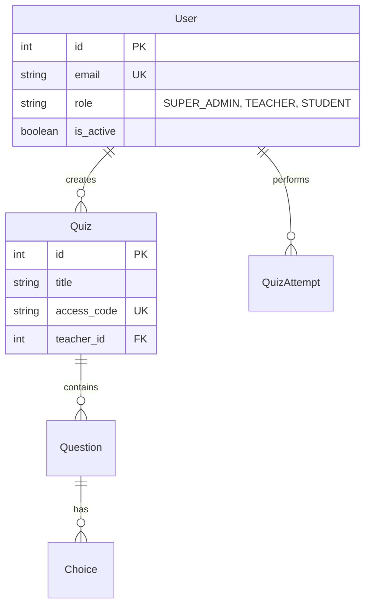

<div align="center">

# 🎓 Zedny Educational Platform

### Interactive Gamified Learning Solution

[](https://opensource.org/licenses/MIT)
[](https://www.python.org/)
[](https://fastapi.tiangolo.com/)
[](https://reactjs.org/)
[](https://www.postgresql.org/)

**A comprehensive educational platform combining interaction and gamification to enhance the learning experience.**

[Demo](#demo) • [Installation](#installation) • [Documentation](#documentation) • [Contributing](#contributing)

</div>

---

## 📖 Overview

**Zedny** is an innovative interactive educational platform designed to transform traditional learning into an engaging and interactive experience. Developed using modern technologies, it provides a sophisticated learning environment that supports both teachers and students.

### 🎯 Vision
The platform aims to bridge the gap between traditional education and modern technology by providing interactive tools that make learning more enjoyable and effective.

### 🏛️ Project Philosophy
Designed with **Scalability**, **Security**, and **User Experience** as core pillars. The architecture follows modern best practices, using asynchronous patterns in the backend and a modular, component-based approach in the frontend to ensure a seamless and performant experience for thousands of concurrent users.

### ✨ Key Features

| Feature | Description |
|--------|-------|
| 🧠 **AI Question Generation** | Uses Google Gemini and OpenAI to automatically generate questions from PDF files and text. |
| 📝 **Multiple Question Types** | Support for Multiple Choice, True/False, and Multiple Select questions. |
| ⏱️ **Question Timer** | Customizable timing system for each question. |
| 🏆 **Leaderboard & Scoring** | Tracks student performance and displays competitive leaderboards. |
| 🔐 **Secure Authentication** | Secure login system using JWT (JSON Web Tokens). |
| 📱 **Responsive Design** | Works seamlessly across all devices and screen sizes. |
| 🛡️ **Super Admin Panel** | Comprehensive system oversight, health monitoring, and user management. |

---

## 🏗️ Project Architecture

```
zedny-project/
│
├── 📁 backend/                          # Backend Server (FastAPI)
│   ├── 📁 app/                          # Main Application
│   │   ├── 📁 api/                      # API Endpoints
│   │   │   └── 📁 v1/                   # API Version 1
│   │   │       ├── 📁 endpoints/        # Logic Endpoints
│   │   │       │   ├── auth.py          # Authentication
│   │   │       │   ├── admin.py         # Super Admin Operations
│   │   │       │   ├── quizzes.py       # Quiz Management
│   │   │       │   └── generate.py      # AI Question Generation
│   │   │       └── api.py               # Router aggregation
│   │   │
│   │   ├── 📁 core/                     # Core Configuration
│   │   │   ├── config.py                # App Settings
│   │   │   └── security.py              # JWT & Hashing
│   │   │
│   │   ├── 📁 db/                       # Database
│   │   │   └── session.py               # Session Management
│   │   │
│   │   ├── 📁 models/                   # DB Models (SQLAlchemy)
│   │   │   ├── user.py                  # User & Roles
│   │   │   └── quiz.py                  # Quiz, Question, Choice
│   │   │
│   │   ├── 📁 schemas/                  # Pydantic Schemas
│   │   │   ├── user.py                  # User Validation
│   │   │   └── admin.py                 # Admin Dashboard Schemas
│   │   │
│   │   ├── 📁 services/                 # Business Logic
│   │   │   ├── ai_service.py            # Gemini AI Integration
│   │   │   └── pdf_service.py           # text extraction
│   │   │
│   │   └── main.py                      # App Entry Point
│   │
│   ├── 📁 alembic/                      # Database Migrations
│   ├── .env                             # Environment Variables (Private)
│   ├── run.py                           # Server startup script
│   └── manage_admin.py                  # Admin management utility
│
├── 📁 frontend-react/                   # Frontend (React + Vite)
│   ├── 📁 src/                          # Source Code
│   │   ├── 📁 components/               # Reusable Components
│   │   ├── 📁 context/                  # State Management (Auth, Notify)
│   │   ├── 📁 pages/                    # Application Views
│   │   │   ├── SuperAdminDashboard.jsx  # Admin Command Center
│   │   │   ├── TeacherDashboard.jsx     # Teacher Portal
│   │   │   └── StudentDashboard.jsx     # Student Portal
│   │   │
│   │   └── App.jsx                      # Main Router
│   │
│   └── vite.config.js                   # Vite Settings
│
├── requirements.txt                     # Python Dependencies
└── Run_Project.bat                      # One-click startup script
```

---

## 🛠️ Tech Stack

### Backend
- **Python 3.9+**
- **FastAPI**: Modern, high-performance web framework.
- **SQLAlchemy 2.0**: Async ORM for database interaction.
- **PostgreSQL**: Reliable relational database.
- **Alembic**: Database migration management.
- **JWT**: Secure token-based authentication.

### Frontend
- **React 18**: Component-based UI library.
- **Vite**: Ultra-fast build tool.
- **Lucide React**: Modern iconography.
- **CSS Modules**: Scoped and maintainable styling.

### AI & Services
- **Google Gemini**: Dynamic question generation.
- **psutil**: System health monitoring (telemetry).
- **LangChain**: Advanced text processing for AI.

---

## 🚀 Installation & Setup

### Prerequisites
- Python 3.9+
- Node.js 18+
- PostgreSQL 15+

### 1️⃣ Automatic Startup (Recommended)
We've provided a batch file for Windows users to start everything at once:
```bash
# Just double click this file in the root directory
Run_Project.bat
```

### 2️⃣ Manual Setup

#### Backend Setup
```bash
cd backend
python -m venv venv
.\venv\Scripts\activate
pip install -r requirements.txt
# Configure your .env file
python run.py
```

#### Admin Setup
To create your initial Super Admin account:
```bash
cd backend
python manage_admin.py
```

#### Frontend Setup
```bash
cd frontend-react
npm install
npm run dev
```

---

## 📊 Data Model



---

## 🔒 Security Features
- **Bcrypt Hashing**: Industry-standard password encryption.
- **JWT Authorization**: Secure, stateless user sessions.
- **Role-Based Access Control (RBAC)**: Strict separation between Admin, Teacher, and Student capabilities.
- **CORS Protection**: Restricted cross-origin resource sharing.

---

## 👥 Contributing
Contributions are welcome! Please follow these steps:
1. Fork the project.
2. Create a feature branch (`git checkout -b feature/AmazingFeature`).
3. Commit your changes (`git commit -m 'Add AmazingFeature'`).
4. Push to the branch (`git push origin feature/AmazingFeature`).
5. Open a Pull Request.

---

## 📄 License
This project is licensed under the MIT License - see the [LICENSE](LICENSE) file for details.

---

<div align="center">

**Built with ❤️ to revolutionize education.**

</div>
